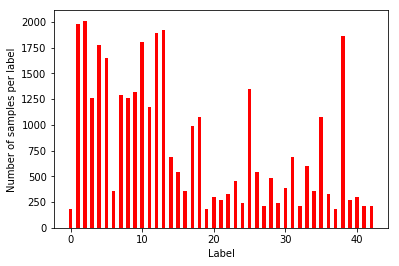
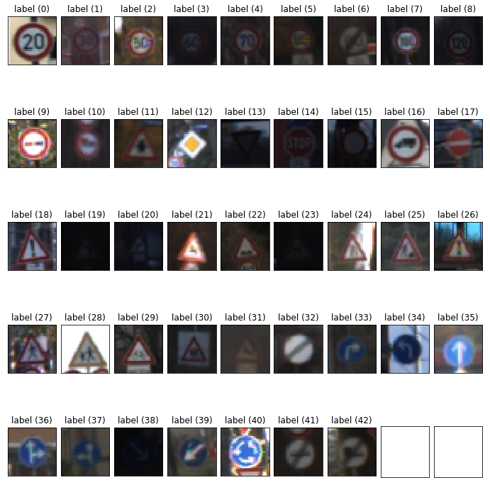

# Self-Driving Car Engineer Nanodegree

## Deep Learning

## Project: Build a Traffic Sign Recognition Classifier

This notebook, describes how I built the Traffic sign Classifier.

---
## Step 0: Load The Data
At first we will need to load the data from the pickle files.


```python
# Load pickled data
import pickle

training_file = "data/train.p"
validation_file="data/valid.p"
testing_file = "data/test.p"

with open(training_file, mode='rb') as f:
    train = pickle.load(f)
with open(validation_file, mode='rb') as f:
    valid = pickle.load(f)
with open(testing_file, mode='rb') as f:
    test = pickle.load(f)
    
X_train, y_train = train['features'], train['labels']
X_valid, y_valid = valid['features'], valid['labels']
X_test, y_test = test['features'], test['labels']

```

---

## Step 1: Dataset Summary & Exploration

The pickled data is a dictionary with 4 key/value pairs:

- `'features'` is a 4D array containing raw pixel data of the traffic sign images, (num examples, width, height, channels).
- `'labels'` is a 1D array containing the label/class id of the traffic sign. The file `signnames.csv` contains id -> name mappings for each id.
- `'sizes'` is a list containing tuples, (width, height) representing the original width and height the image.


### A Basic Summary of the Data Set


```python
### Replace each question mark with the appropriate value. 
### Use python, pandas or numpy methods rather than hard coding the results
import numpy as np

# Number of training examples
n_train = len(X_train)

# Number of validation examples
n_validation = len(X_valid)

# Number of testing examples.
n_test = len(X_test)

# the shape of an traffic sign image?
image_shape = X_train[0].shape

# How many unique classes/labels there are in the dataset.
n_classes = len(np.unique(y_train))

print("Number of training examples =", n_train)
print("Number of testing examples =", n_test)
print("Image data shape =", image_shape)
print("Number of classes =", n_classes)
```

    Number of training examples = 34799
    Number of testing examples = 12630
    Image data shape = (32, 32, 3)
    Number of classes = 43
    

### Visualization of the dataset

Here i plot a grapth representing number of sample for each class.


```python
### Data exploration visualization code goes here.
import matplotlib.pyplot as plt

# Visualizations will be shown in the notebook.
%matplotlib inline

fig, ax = plt.subplots()
x,indexs,y = np.unique(y_train,return_counts = True,return_index=True)
ax.bar(x, y, .5, color='r')
ax.set_xlabel('Label')
ax.set_ylabel('Number of samples per label')

# indexs = np.random.randint(0, len(X_train),18)

fig, axes = plt.subplots(5, 9, figsize=(12, 12),
                         subplot_kw={'xticks': [], 'yticks': []})

fig.subplots_adjust(hspace=1, wspace=0.1)

for ax, index in zip(axes.flat, indexs):
    ax.imshow(X_train[index])
    ax.set_title("label ({})".format(y_train[index]))

plt.show()


```








----

## Step 2: Design and Test a Model Architecture


### Pre-process the Data Set (normalization, grayscale, etc.)

The first step I have done is to convert my images into gray scale to reduce the network's complexity by having only one color channel. Then I applied a Histogram Equalization as we have some dark images in our data set.

Finally, the image data should be normalized so that the data has mean zero and equal variance.


```python
### Preprocess the data here. It is required to normalize the data. Other preprocessing steps could include 
### converting to grayscale, etc.
### Feel free to use as many code cells as needed.
from sklearn.utils import shuffle
import cv2
```


```python
def normalize_grayscale(image_data):
    """
    Normalize the image data with Min-Max scaling to a range of [0.1, 0.9]
    :param image_data: The image data to be normalized
    :return: Normalized image data
    """
    a = 0.1
    b = 0.9
    return (a + (image_data)*(b - a)/255)

def grayscale(img):
    """Applies the Grayscale transform
    This will return an image with only one color channel"""
    return cv2.cvtColor(img, cv2.COLOR_RGB2GRAY)

def preprocess_data(data):
    preprocessed_data = []
    for image in data:
        image = grayscale(image)
        image = cv2.equalizeHist(image)
        image = normalize_grayscale(image)
        preprocessed_data.append(image)
    return preprocessed_data
```


```python
X_train = preprocess_data(X_train)
X_valid = preprocess_data(X_valid)
X_test = preprocess_data(X_test)
```

Now let's have another look on the same sample images after preprocessing


```python
fig, axes = plt.subplots(5, 9, figsize=(12, 12),
                         subplot_kw={'xticks': [], 'yticks': []})

fig.subplots_adjust(hspace=1, wspace=0.1)

for ax, index in zip(axes.flat, indexs):
    ax.imshow(X_train[index],cmap='gray')
    ax.set_title("label ({})".format(y_train[index]))
```


### Model Architecture

Here I used the LeNet achitecture with some modification. Basically I added two dropout steps at the output of layers 3 and 4 to improve the network's performance.


```python
import tensorflow as tf
from tensorflow.contrib.layers import flatten
from numpy import array

def LeNet(x,keep_prob):    
    # Arguments used for tf.truncated_normal, randomly defines variables for the weights and biases for each layer
    mu = 0
    sigma = 0.1
    
    # Layer 1: Convolutional. Input = 32x32x1. Output = 28x28x6.
    conv1_W = tf.Variable(tf.truncated_normal(shape=(5, 5, 1, 6), mean = mu, stddev = sigma))
    conv1_b = tf.Variable(tf.zeros(6))
    conv1   = tf.nn.conv2d(x, conv1_W, strides=[1, 1, 1, 1], padding='VALID') + conv1_b

    # Activation.
    conv1 = tf.nn.relu(conv1)

    # Pooling. Input = 28x28x6. Output = 14x14x6.
    conv1 = tf.nn.max_pool(conv1, ksize=[1, 2, 2, 1], strides=[1, 2, 2, 1], padding='VALID')

    # Layer 2: Convolutional. Output = 10x10x16.
    conv2_W = tf.Variable(tf.truncated_normal(shape=(5, 5, 6, 16), mean = mu, stddev = sigma))
    conv2_b = tf.Variable(tf.zeros(16))
    conv2   = tf.nn.conv2d(conv1, conv2_W, strides=[1, 1, 1, 1], padding='VALID') + conv2_b
    
    # Activation.
    conv2 = tf.nn.relu(conv2)

    # Pooling. Input = 10x10x16. Output = 5x5x16.
    conv2 = tf.nn.max_pool(conv2, ksize=[1, 2, 2, 1], strides=[1, 2, 2, 1], padding='VALID')

    # Flatten. Input = 5x5x16. Output = 400.
    fc0   = flatten(conv2)
    
    # Layer 3: Fully Connected. Input = 400. Output = 120.
    fc1_W = tf.Variable(tf.truncated_normal(shape=(400, 120), mean = mu, stddev = sigma))
    fc1_b = tf.Variable(tf.zeros(120))
    fc1   = tf.matmul(fc0, fc1_W) + fc1_b
    
    # Activation.
    fc1    = tf.nn.relu(fc1)
    fc1 = tf.nn.dropout(fc1, keep_prob)

    # Layer 4: Fully Connected. Input = 120. Output = 84.
    fc2_W  = tf.Variable(tf.truncated_normal(shape=(120, 84), mean = mu, stddev = sigma))
    fc2_b  = tf.Variable(tf.zeros(84))
    fc2    = tf.matmul(fc1, fc2_W) + fc2_b
    
    
    # Activation.
    fc2    = tf.nn.relu(fc2)
    fc2 = tf.nn.dropout(fc2, keep_prob)

    # Layer 5: Fully Connected. Input = 84. Output = 43.
    fc3_W  = tf.Variable(tf.truncated_normal(shape=(84, 43), mean = mu, stddev = sigma))
    fc3_b  = tf.Variable(tf.zeros(43))
    logits = tf.matmul(fc2, fc3_W) + fc3_b
    
    return logits,conv1,conv2
```


```python
x = tf.placeholder(tf.float32, (None, 32, 32, 1))
y = tf.placeholder(tf.int32, (None))
keep_prob = tf.placeholder(tf.float32)
one_hot_y = tf.one_hot(y, 43)
EPOCHS = 40
BATCH_SIZE = 128
rate = 0.001
```


```python
logits,conv1,conv2 = LeNet(x,keep_prob)
cross_entropy = tf.nn.softmax_cross_entropy_with_logits(labels=one_hot_y, logits=logits)
loss_operation = tf.reduce_mean(cross_entropy)
optimizer = tf.train.AdamOptimizer(learning_rate = rate)
training_operation = optimizer.minimize(loss_operation)
```


```python
correct_prediction = tf.equal(tf.argmax(logits, 1), tf.argmax(one_hot_y, 1))
accuracy_operation = tf.reduce_mean(tf.cast(correct_prediction, tf.float32))
saver = tf.train.Saver()

def evaluate(X_data, y_data):
    num_examples = len(X_data)
    total_accuracy = 0
    sess = tf.get_default_session()
    for offset in range(0, num_examples, BATCH_SIZE):
        batch_x, batch_y = X_data[offset:offset+BATCH_SIZE], y_data[offset:offset+BATCH_SIZE]
        accuracy = sess.run(accuracy_operation, feed_dict={x: batch_x, y: batch_y, keep_prob : 1})
        total_accuracy += (accuracy * len(batch_x))
    return total_accuracy / num_examples
```

### Train, Validate and Test the Model

In the next step we will train the model and then save it.

#### Train the model


```python
with tf.Session() as sess:
    sess.run(tf.global_variables_initializer())
    num_examples = len(X_train)
    
    print("Training...")
    print()
    X_valid = np.expand_dims(X_valid, axis=3)
    for i in range(EPOCHS):
        X_train, y_train = shuffle(X_train, y_train)
        for offset in range(0, num_examples, BATCH_SIZE):
            end = offset + BATCH_SIZE
            batch_x, batch_y = X_train[offset:end], y_train[offset:end]
            batch_x = np.expand_dims(batch_x, axis=3)
            sess.run(training_operation, feed_dict={x: batch_x, y: batch_y, keep_prob : 0.5})
            
        
        validation_accuracy = evaluate(X_valid, y_valid)
        print("EPOCH {} ...".format(i+1))
        print("Validation Accuracy = {:.3f}".format(validation_accuracy))
        print()
        
    saver.save(sess, './lenet')
    print("Model saved")
```

    Training...
    
    EPOCH 1 ...
    Validation Accuracy = 0.567
    
    EPOCH 2 ...
    Validation Accuracy = 0.778
    
    EPOCH 3 ...
    Validation Accuracy = 0.834
    
    EPOCH 4 ...
    Validation Accuracy = 0.859
    
    EPOCH 5 ...
    Validation Accuracy = 0.868
    
    EPOCH 6 ...
    Validation Accuracy = 0.901
    
    EPOCH 7 ...
    Validation Accuracy = 0.913
    
    EPOCH 8 ...
    Validation Accuracy = 0.918
    
    EPOCH 9 ...
    Validation Accuracy = 0.928
    
    EPOCH 10 ...
    Validation Accuracy = 0.928
    
    EPOCH 11 ...
    Validation Accuracy = 0.933
    
    EPOCH 12 ...
    Validation Accuracy = 0.931
    
    EPOCH 13 ...
    Validation Accuracy = 0.940
    
    EPOCH 14 ...
    Validation Accuracy = 0.946
    
    EPOCH 15 ...
    Validation Accuracy = 0.944
    
    EPOCH 16 ...
    Validation Accuracy = 0.944
    
    EPOCH 17 ...
    Validation Accuracy = 0.949
    
    EPOCH 18 ...
    Validation Accuracy = 0.949
    
    EPOCH 19 ...
    Validation Accuracy = 0.949
    
    EPOCH 20 ...
    Validation Accuracy = 0.945
    
    EPOCH 21 ...
    Validation Accuracy = 0.953
    
    EPOCH 22 ...
    Validation Accuracy = 0.957
    
    EPOCH 23 ...
    Validation Accuracy = 0.957
    
    EPOCH 24 ...
    Validation Accuracy = 0.953
    
    EPOCH 25 ...
    Validation Accuracy = 0.947
    
    EPOCH 26 ...
    Validation Accuracy = 0.944
    
    EPOCH 27 ...
    Validation Accuracy = 0.957
    
    EPOCH 28 ...
    Validation Accuracy = 0.949
    
    EPOCH 29 ...
    Validation Accuracy = 0.959
    
    EPOCH 30 ...
    Validation Accuracy = 0.956
    
    EPOCH 31 ...
    Validation Accuracy = 0.951
    
    EPOCH 32 ...
    Validation Accuracy = 0.953
    
    EPOCH 33 ...
    Validation Accuracy = 0.953
    
    EPOCH 34 ...
    Validation Accuracy = 0.954
    
    EPOCH 35 ...
    Validation Accuracy = 0.956
    
    EPOCH 36 ...
    Validation Accuracy = 0.955
    
    EPOCH 37 ...
    Validation Accuracy = 0.960
    
    EPOCH 38 ...
    Validation Accuracy = 0.958
    
    EPOCH 39 ...
    Validation Accuracy = 0.955
    
    EPOCH 40 ...
    Validation Accuracy = 0.956
    
    Model saved
    

#### Evaluate the model


```python
with tf.Session() as sess:
    saver.restore(sess, tf.train.latest_checkpoint('.'))
    X_test = np.expand_dims(X_test, axis=3)
    test_accuracy = evaluate(X_test, y_test)
    print("Test Accuracy = {:.3f}".format(test_accuracy))
```

    INFO:tensorflow:Restoring parameters from .\lenet
    Test Accuracy = 0.931
    

---

## Step 3: Test a Model on New Images

Now let's try our model on 5 new images from the internet

### Load and Output the Images


```python
from os import listdir
from os.path import isfile, join
import cv2

files = [f for f in listdir('images/') if isfile(join('images/', f))]

images = []
labels = []
for file in files:
    image = cv2.imread(join('images/', file),-1)
    label = file.split('_')[0]
    images.append(image)
    labels.append(label)
images = preprocess_data(images)
```

Now let's visualize the data


```python
fig, axes = plt.subplots(1, 5, figsize=(9, 9),
                         subplot_kw={'xticks': [], 'yticks': []})

fig.subplots_adjust(hspace=2, wspace=0.1)

for ax, image,label in zip(axes.flat, images,labels):
    ax.imshow(image,cmap='gray')
    ax.set_title("label ({})".format(label))

```


### Predict the Sign Type for Each Image


```python
def getPrediction(X_data):
    num_examples = len(X_data)
    with tf.Session() as sess:
        saver.restore(sess, tf.train.latest_checkpoint('.'))
        batch_x = np.expand_dims(X_data, axis=3)
        predictions = sess.run(logits, feed_dict={x: batch_x, keep_prob : 1})
        top_predictions = sess.run(tf.nn.top_k(predictions, k=5))
        predictions = sess.run(tf.argmax(predictions, 1))
    return predictions,top_predictions

predictions, top_predictions = getPrediction(images)


fig, axes = plt.subplots(1, 5, figsize=(9, 9),
                         subplot_kw={'xticks': [], 'yticks': []})

fig.subplots_adjust(hspace=2, wspace=0.1)

for ax, image,label in zip(axes.flat, images,predictions):
    ax.imshow(image,cmap='gray')
    ax.set_title("Prediction ({})".format(label))
```

    INFO:tensorflow:Restoring parameters from .\lenet
    


### Analyze Performance


```python
### Calculate the accuracy for these 5 new images. 
with tf.Session() as sess:
    saver.restore(sess, tf.train.latest_checkpoint('.'))
    batch_x = np.expand_dims(images, axis=3)
    test_accuracy = evaluate(batch_x, labels)
    print("Test Accuracy = {:.3f}".format(test_accuracy))
```

    INFO:tensorflow:Restoring parameters from .\lenet
    Test Accuracy = 0.600
    

### Output Top 5 Softmax Probabilities For Each Image Found on the Web

For each of the new images, we print out the model's softmax probabilities to show the **certainty** of the model's predictions


```python
### Print out the top five softmax probabilities for the predictions on the German traffic sign images found on the web. 
print(top_predictions)
```

    TopKV2(values=array([[ 37.08348465,   1.05275941,  -5.20464945,  -9.34842491,
            -11.75564194],
           [  6.71199036,   3.33718348,   3.07043242,   1.51997912,
              0.58827156],
           [ 17.54683304,  12.52876759,   4.20278883,   3.61728024,
              2.95892763],
           [ 25.49307632,  11.82583618,  10.5564394 ,   2.01921844,
              1.34329176],
           [ 15.0106287 ,   6.58296251,   1.84210634,   1.3458631 ,
             -0.71231902]], dtype=float32), indices=array([[12, 13, 40, 42, 35],
           [18, 40, 27, 37, 26],
           [31, 21, 29, 23, 19],
           [ 4,  8, 15,  7, 39],
           [13, 12, 35,  9, 10]]))
    

---

## Step 4 : Visualize the Neural Network's State with Test Images

 We can understand what the weights of a neural network look like better by plotting their feature maps. After successfully training our neural network we can see what it's feature maps look like by plotting the output of the network's weight layers in response to a test stimuli image. From these plotted feature maps, it's possible to see what characteristics of an image the network finds interesting. For a sign, maybe the inner network feature maps react with high activation to the sign's boundary outline or to the contrast in the sign's painted symbol.


```python
# image_input: the test image being fed into the network to produce the feature maps
# tf_activation: should be a tf variable name used during your training procedure that represents the calculated state of a specific weight layer
# activation_min/max: can be used to view the activation contrast in more detail, by default matplot sets min and max to the actual min and max values of the output
# plt_num: used to plot out multiple different weight feature map sets on the same block, just extend the plt number for each new feature map entry

def outputFeatureMap(image_input, tf_activation, activation_min=-1, activation_max=-1 ,plt_num=1):
    # Here make sure to preprocess your image_input in a way your network expects
    # with size, normalization, ect if needed
    # image_input =
    # Note: x should be the same name as your network's tensorflow data placeholder variable
    # If you get an error tf_activation is not defined it may be having trouble accessing the variable from inside a function
    with tf.Session() as sess:
        saver.restore(sess, tf.train.latest_checkpoint('.'))
        image_extended = np.expand_dims(image_input, axis=0)
        image_extended = np.expand_dims(image_extended, axis=3)
        activation = tf_activation.eval(session=sess,feed_dict={x : image_extended})
        featuremaps = activation.shape[3]
        plt.figure(plt_num, figsize=(15,15))
        for featuremap in range(featuremaps):
            plt.subplot(6,8, featuremap+1) # sets the number of feature maps to show on each row and column
            plt.title('FeatureMap ' + str(featuremap)) # displays the feature map number
            if activation_min != -1 & activation_max != -1:
                plt.imshow(activation[0,:,:, featuremap], interpolation="nearest", vmin =activation_min, vmax=activation_max, cmap="gray")
            elif activation_max != -1:
                plt.imshow(activation[0,:,:, featuremap], interpolation="nearest", vmax=activation_max, cmap="gray")
            elif activation_min !=-1:
                plt.imshow(activation[0,:,:, featuremap], interpolation="nearest", vmin=activation_min, cmap="gray")
            else:
                plt.imshow(activation[0,:,:, featuremap], interpolation="nearest", cmap="gray")
```


```python
outputFeatureMap(images[0],conv1)
```

    INFO:tensorflow:Restoring parameters from .\lenet
    


```python
outputFeatureMap(images[0],conv2)
```

    INFO:tensorflow:Restoring parameters from .\lenet
    


```python

```
